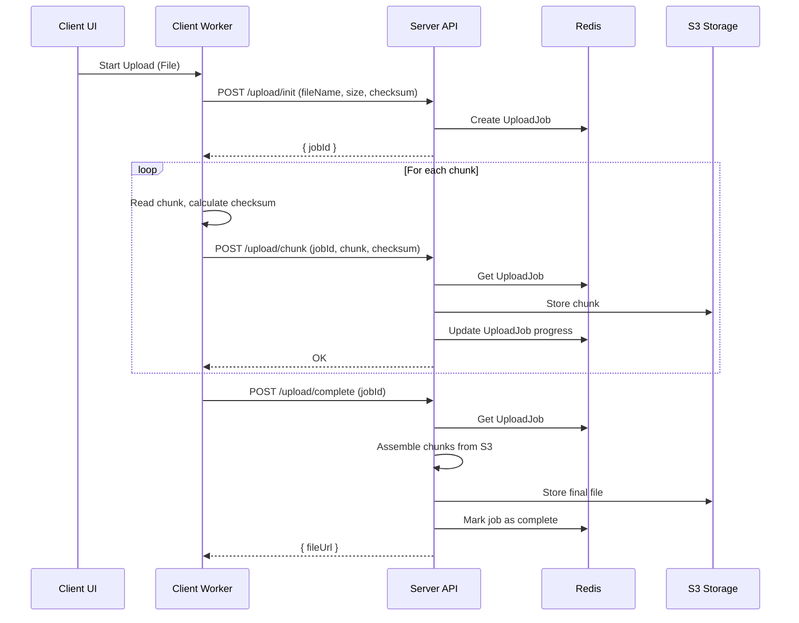
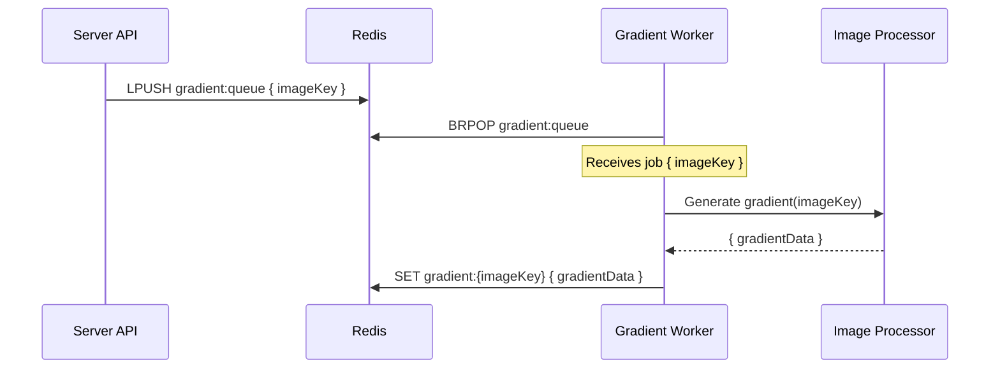
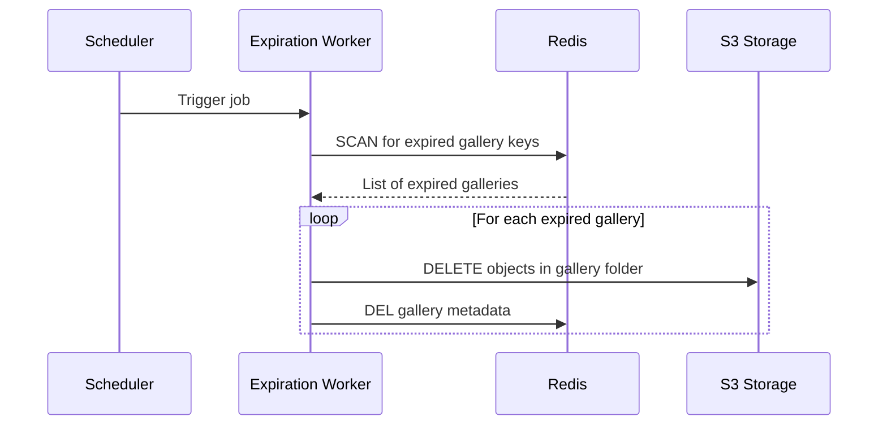
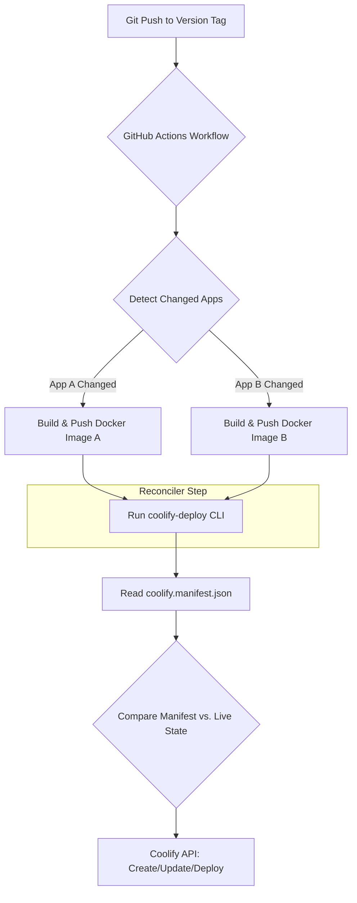

# Photo Gallery 5000

Photo Gallery 5000 is a full-stack gallery management tool optimized for Discord communities that need to ingest large photo drops, curate them per guild, and expose them through a clean browser UI.

## Architecture

### Highlights

- **Chunked Upload Service**: `ChunkedUploadService` assembles large uploads from clients, applies server-side checksums, and writes to S3-compatible storage. Upload job state is stored in Redis, allowing clients to resume interrupted uploads seamlessly.
- **Declarative Deployments**: The [`coolify-deploy` CLI](https://www.npmjs.com/package/coolify-deploy) provides lightweight Infrastructure as Code (IaC). It reads a `coolify.manifest.json` to create, update, and deploy all applications to Coolify, ensuring consistent environments.
- **Background Worker Pipelines**: Redis queues drive multiple background workers, including a `gradient-worker` for generating image placeholders and an `expiration-worker` for cleaning up temporary galleries, ensuring the API remains responsive.
- **Redis-Centric State**: Redis serves as the high-performance backbone for Express sessions, guild/gallery metadata caching, upload job tracking, and worker queues, minimizing database dependency for core operations.
- **End-to-End Type Safety**: A shared `packages/utils` workspace provides Zod schemas that generate TypeScript types. This ensures that data contracts between the React client, Express API, and background workers are always synchronized.
- **Automated CI/CD**: The GitHub Actions workflow in `deploy.yml` automatically builds and pushes images only for changed applications, then runs `coolify-deploy` to deploy them, streamlining the release process.

This repository favors clear separation between validation, controller logic, and infrastructure concerns, enabling confident iteration on either side of the stack while keeping cross-cutting concerns (uploads, gradients, Redis) testable end-to-end.

### Services

| Service               | Description                                                                                                        | Package Path           |
| :-------------------- | :----------------------------------------------------------------------------------------------------------------- | :--------------------- |
| **Client**            | The React/Vite front-end application that provides the user interface for browsing galleries and uploading photos. | `apps/client`          |
| **Server**            | The core Express API that handles authentication, gallery management, and orchestrates upload/worker jobs.         | `apps/server`          |
| **Gradient Worker**   | A background worker that processes images to generate placeholder gradients for a smoother loading experience.     | `apps/server`          |
| **Expiration Worker** | A background worker that periodically cleans up expired or temporary galleries to manage storage.                  | `apps/server`          |
| **Deployment CLI**    | A CLI tool that provides declarative, manifest-based deployments to the Coolify hosting platform.                  | `coolify-deploy` (npm) |
| **Shared Utilities**  | A shared library containing Zod schemas and TypeScript types to ensure consistency across the monorepo.            | `packages/utils`       |

## Workflows

### Image Upload Workflow

This workflow enables resilient, resumable uploads of large files by breaking them into chunks on the client. A browser-based web worker handles the chunking, checksum calculation, and uploading in the background, ensuring the UI remains responsive. The server validates and assembles these chunks, with Redis tracking job progress to allow clients to seamlessly resume interrupted uploads.

### Gradient Placeholder Generation Workflow

To improve perceived performance, a background worker generates placeholder gradients for newly uploaded images. When an upload is complete, a job is added to a Redis queue. The `gradient-worker` processes this queue, generates a compact gradient, and stores it in Redis. Clients can then load this tiny placeholder almost instantly while the full-resolution image loads in the background.

### Gallery Expiration Workflow

This workflow provides automated cleanup of temporary galleries to conserve storage resources. An `expiration-worker` runs on a schedule, scanning Redis for galleries that have passed their Time-to-Live (TTL). For each expired gallery, the worker deletes all associated image files from S3 storage and removes the gallery's metadata from Redis.

### Deployment and Resource Reconciliation

This repository uses a declarative, Infrastructure as Code (IaC) approach to deployments. Coolify does not yet have a mature Terraform provider, so a custom reconciliation tool was created and published to npm as `coolify-deploy`. When a new version tag is pushed, a GitHub Actions workflow builds and pushes Docker images for any changed applications. It then runs the `coolify-deploy` CLI, which reads `coolify.manifest.json`, compares it against the live environment in Coolify, and makes API calls to create, update, and deploy resources as needed.

> **Note:** The implementation for this workflow was originally part of this monorepo but has been moved to its own repository, [`julianstephens/coolify-deploy`](https://github.com/julianstephens/coolify-deploy), to promote reusability.

